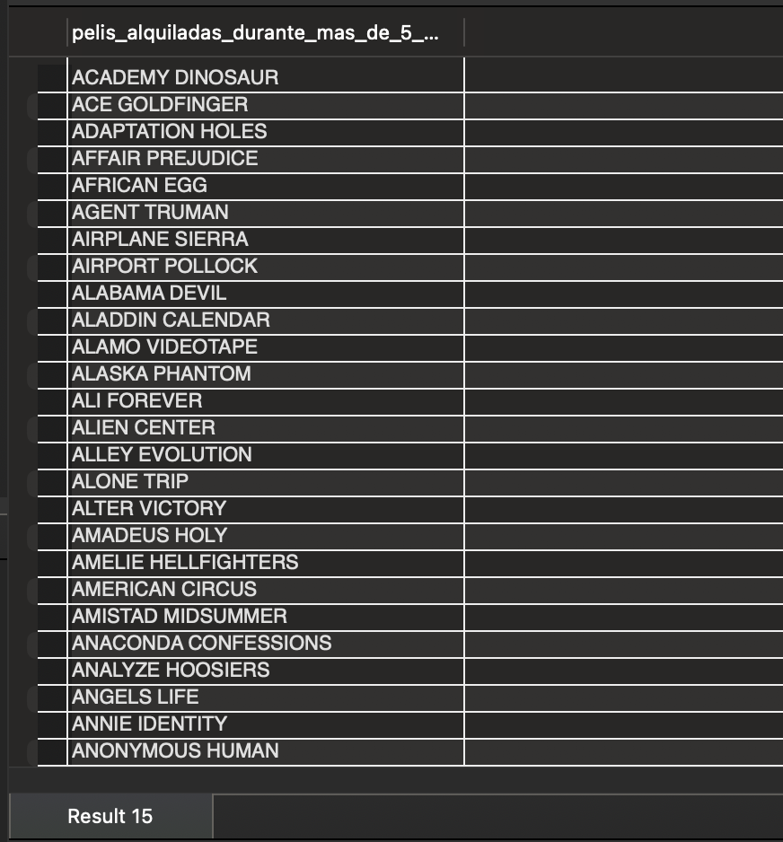

Readme Evaluación Módulo 2 Andrea Gauger

# Ejercicio Evaluación SQL

## Descripción
Este repositorio contiene el ejercicio de evaluación correspondiente al módulo 02: SQL del Bootcamp de Data Analyst de ADALAB. El objetivo de esta prueba es evaluar la capacidad de escribir queries SQL eficientes para resolver problemas típicos relacionados con bases de datos y análisis de datos.

## Estructura de la Base de Datos
La base de datos utilizada para esta evaluación es una base de datos de gestión de alquileres de películas. Las tablas relevantes incluyen:

- actor: Información sobre los actores y actrices.
- film: Información sobre todas las películas.
- rental: Registros de alquileres de películas, que incluyen las fechas de alquiler y devolución.
- inventory: Información sobre el inventario de películas.
- film_category: Relación entre las películas y sus categorías.
- category: Categorías a las que pertenecen las películas (por ejemplo, "Action", "Family", "Comedy").

## Ejemplos de Queries Realizadas
1. Consulta sobre la cantidad de peliculas que ha alquilado cada cliente:

2. Consulta para conocer las películas que fueron alquiladas durante más de 5 días.

## Requisitos
SQL compatible con MySQL.
Acceso a las tablas actor, film, rental, inventory, film_category y category dentro de una base de datos de ejemplo de alquiler de películas.
Uso de las funciones estándar de SQL como JOIN, COUNT, GROUP BY, subconsultas y operadores lógicos.

## Instalación
Clona este repositorio:

bash
Copiar
git clone <url_del_repositorio>
Carga el archivo SQL (si se proporciona) en tu servidor de base de datos MySQL.

Asegúrate de que las tablas necesarias estén disponibles para ejecutar las consultas proporcionadas.

## Conclusión
Esta prueba de evaluación tiene como objetivo poner a prueba los conocimientos adquiridos sobre SQL, incluyendo el uso de JOIN, funciones de agregación, subconsultas y operaciones de filtrado. Las consultas desarrolladas resuelven problemas reales relacionados con bases de datos de gestión de alquileres de películas.

Este README proporciona un resumen claro del proyecto y las consultas realizadas, junto con instrucciones sencillas sobre cómo usar el código. Puedes adaptarlo o agregar más detalles si lo consideras necesario. ¡Buena suerte!

